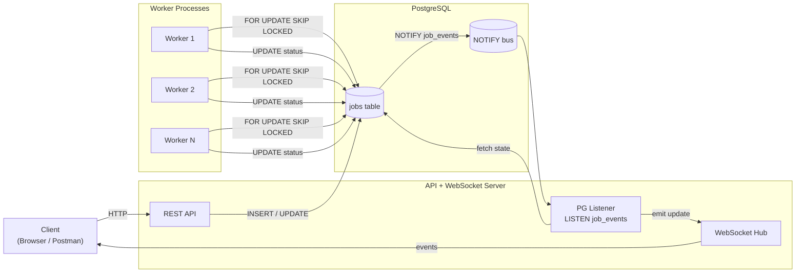

# Job Queue System

**PostgreSQL · Node.js · Workers · WebSockets**

A production‑style **job queue system** built with Node.js and PostgreSQL, supporting concurrent workers, failure recovery, and real‑time job status updates using **PostgreSQL `LISTEN / NOTIFY` + WebSockets**.

This project emphasizes **correctness under concurrency**, **process isolation**, and **event‑driven architecture**.

---

## ✨ Features

* Persistent job queue backed by PostgreSQL
* Safe concurrent job claiming (`FOR UPDATE SKIP LOCKED`)
* Multiple worker processes supported
* Automatic recovery of abandoned jobs
* Real‑time job status updates via WebSockets
* Event signaling using PostgreSQL `LISTEN / NOTIFY`
* No polling, no shared memory, no race conditions

---

## 🏗 Architecture Overview

### High-Level Architecture (Event-Driven)



### Data & Control Flow Summary

1. **Clients** create jobs via HTTP and subscribe via WebSockets.
2. **Workers** concurrently claim jobs using row-level locks.
3. **Workers** update job state transactionally and emit `NOTIFY` signals.
4. **API server** listens for database events, re-reads state, and broadcasts updates.
5. **WebSockets** deliver real-time job status to subscribed clients.

---

## 📂 Project Structure

```
Job-Queue/
├── src/
│   ├── api/
│   │   └── routes.js        # HTTP API routes
│   │
│   ├── db/
│   │   ├── pool.js          # PostgreSQL pool & queries
│   │   └── listener.js      # LISTEN job_events
│   │
│   ├── jobs/
│   │   ├── jobRepo.js       # Job DB operations
│   │   └── worker.js        # Worker execution loop
│   │
│   ├── socket/
│   │   └── socket.js        # WebSocket server
│   │
│   └── index.js             # API entry point
│
├── package.json
├── package-lock.json
└── README.md
```

---

## 🗃 Database Schema

```sql
CREATE TABLE jobs (
  id SERIAL PRIMARY KEY,
  type TEXT NOT NULL,
  payload JSONB,
  status TEXT NOT NULL,
  attempts INT DEFAULT 0,
  max_attempts INT DEFAULT 3,
  error TEXT,
  created_at TIMESTAMP DEFAULT NOW(),
  started_at TIMESTAMP,
  finished_at TIMESTAMP
);
```

---

## 🔁 Job Lifecycle

* **PENDING** – job created
* **RUNNING** – claimed by a worker
* **SUCCESSFUL** – completed successfully
* **FAILED** – failed (retryable)
* **RETRY** – re‑queued if `attempts < max_attempts`

All state transitions occur **inside database transactions**.

---

## 🔒 Concurrency & Correctness

### Safe Job Claiming

```sql
SELECT id
FROM jobs
WHERE status = 'PENDING'
ORDER BY created_at
LIMIT 1
FOR UPDATE SKIP LOCKED;
```

**Guarantees**

* No two workers can claim the same job
* Safe parallel worker execution
* No race conditions

---

## 🔔 Real‑Time Updates (LISTEN / NOTIFY)

### Why LISTEN / NOTIFY?

* No polling
* No shared memory
* Transaction‑aware
* Database‑native signaling

### Event Flow

**Worker**

```sql
UPDATE jobs SET status = 'SUCCESSFUL' WHERE id = 42;
NOTIFY job_events, '{"jobId":42}';
```

**API**

```sql
LISTEN job_events;
```

On notification:

1. Fetch job state from the database
2. Emit WebSocket update

> Notifications carry **identity (jobId)**, not state. State is always re‑read from the database.

---

## 🔌 WebSocket Protocol

### Subscribe

```json
{
  "action": "subscribe",
  "jobId": 42
}
```

### Unsubscribe

```json
{
  "action": "unsubscribe",
  "jobId": 42
}
```

### Server → Client Event

```json
{
  "jobId": 42,
  "status": "SUCCESSFUL",
  "attempts": 1,
  "error": null
}
```

---

## 🚀 Running the Project

### Install Dependencies

```bash
npm install
```

### Start API + WebSocket Server

```bash
npm run api
```

### Start Worker (run multiple for concurrency)

```bash
npm run worker
```

---

## 🧪 Testing with Postman

1. `POST /api/jobs` → create a job

2. Save `jobId` from response

3. Open WebSocket connection:

   ```
   ws://localhost:8080
   ```

4. Subscribe:

   ```json
   { "action": "subscribe", "jobId": 42 }
   ```

5. Observe real‑time job updates

---

## ❌ Why Not Polling or Webhooks?

### Polling

* Missed updates
* Duplicate updates
* Database overhead
* State diffing complexity

### Webhooks

* Tight coupling
* Retry & idempotency complexity
* Additional failure modes

### Chosen Approach

**Database‑driven signaling with best‑effort notifications**

> Correctness lives in the database, not the transport.

---

## 📌 Design Principles

* One process = one responsibility
* Database is the single source of truth
* Workers never talk to WebSockets
* Notifications are signals, not data
* Failures never corrupt state

---

## 📈 Future Improvements

* Redis / Kafka fan‑out
* Job priorities
* Delayed jobs
* Dead‑letter queue
* Authenticated WebSocket subscriptions
* Horizontal scaling

---

## 🧠 Key Takeaway

**Transactions guarantee correctness.**
**NOTIFY guarantees responsiveness.**
**WebSockets guarantee user experience.**

This system is designed to fail safely, scale cleanly, and remain debuggable.
