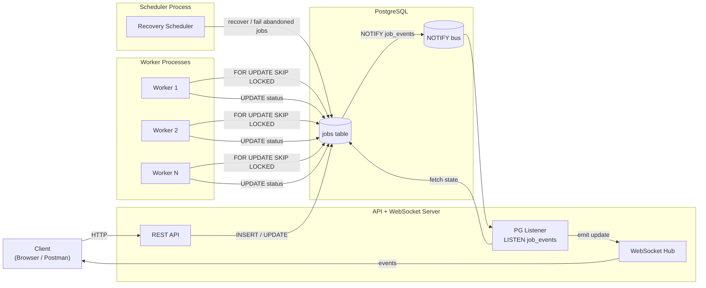

# Job Queue System

**PostgreSQL · Node.js · Workers · WebSockets · Scheduler**

A production‑style **job queue system** built with Node.js and PostgreSQL, supporting concurrent workers, failure recovery, and real‑time job status updates using **PostgreSQL `LISTEN / NOTIFY` + WebSockets**.

This project emphasizes **correctness under concurrency**, **process isolation**, and **event‑driven architecture**.

---

## ✨ Features

* Persistent job queue backed by PostgreSQL
* Safe concurrent job claiming (`FOR UPDATE SKIP LOCKED`)
* Multiple worker processes supported
* Automatic recovery of abandoned jobs via a standalone scheduler
* Real‑time job status updates via WebSockets
* Event signaling using PostgreSQL `LISTEN / NOTIFY`
* No polling, no shared memory, no race conditions

---

## 🏗 Architecture Overview

### High-Level Architecture (Event-Driven)


```mermaid
flowchart LR
    Client["Client<br/>(Browser / Postman)"]

    subgraph API["API + WebSocket Server"]
        HTTP["REST API"]
        WS["WebSocket Hub"]
        LISTENER["PG Listener<br/>LISTEN job_events"]
    end

    subgraph DB["PostgreSQL"]
        JOBS[("jobs table")]
        NOTIFY[("NOTIFY bus")]
    end

    subgraph WORKERS["Worker Processes"]
        W1["Worker 1"]
        W2["Worker 2"]
        WN["Worker N"]
    end

    subgraph SCHEDULER["Scheduler Process"]
        SCH["Recovery Scheduler"]
    end

    Client -->|HTTP| HTTP
    WS -->|events| Client

    HTTP -->|INSERT / UPDATE| JOBS

    W1 -->|FOR UPDATE SKIP LOCKED| JOBS
    W2 -->|FOR UPDATE SKIP LOCKED| JOBS
    WN -->|FOR UPDATE SKIP LOCKED| JOBS

    W1 -->|UPDATE status| JOBS
    W2 -->|UPDATE status| JOBS
    WN -->|UPDATE status| JOBS

    SCH -->|recover / fail abandoned jobs| JOBS

    JOBS -->|NOTIFY job_events| NOTIFY
    NOTIFY --> LISTENER

    LISTENER -->|fetch state| JOBS
    LISTENER -->|emit update| WS
```

### Data & Control Flow Summary

1. **Clients** create jobs via HTTP and subscribe via WebSockets.
2. **Workers** concurrently claim jobs using row-level locks.
3. **Workers** update job state transactionally and emit `NOTIFY` signals.
4. **API server** listens for database events, re-reads state, and broadcasts updates.
5. **WebSockets** deliver real-time job status to subscribed clients.
6. **Recovery Scheduler** periodically polls for abandoned running jobs and either re-queues them (reverting status to `PENDING`) or marks them as `FAILED`.

---

## 📂 Project Structure

```
Job-Queue/
├── .env.example
├── src/
│   ├── api/
│   │   ├── routes/
│   │   │   └── job.routes.js    # HTTP API routes
│   │   ├── services/
│   │   │   └── job.services.js  # API-side DB access helpers
│   │   ├── socket/
│   │   │   └── socket.js        # WebSocket server + subscriptions
│   │   ├── utils/
│   │   │   └── listener.js      # LISTEN job_events bridge to WebSockets
│   │   └── server.js            # API entry point
│   │
│   ├── db/
│   │   ├── db.js                # PostgreSQL pool
│   │   ├── initDB.js            # Runs schema bootstrap
│   │   └── schema.sql           # Database schema
│   │
│   ├── jobs/
│   │   ├── handlers/
│   │   │   ├── cleanup.js       # Cleanup job handler
│   │   │   └── email.js         # Email job handler
│   │   ├── executor.js          # Executes job handlers
│   │   ├── jobRepo.js           # Worker-side DB operations
│   │   ├── scheduler.js         # Standalone recovery scheduler process
│   │   └── worker.js            # Worker process entry point
│
├── package.json
├── package-lock.json
└── README.md
```

---

## 🗃 Database Schema

```sql
CREATE TABLE jobs (
  id UUID PRIMARY KEY DEFAULT gen_random_uuid(),
  type TEXT NOT NULL,
  payload JSONB,
  status TEXT NOT NULL,
  attempts INT DEFAULT 0,
  max_attempts INT DEFAULT 3,
  error TEXT,
  created_at TIMESTAMP DEFAULT NOW(),
  started_at TIMESTAMP,
  finished_at TIMESTAMP
);
```

---

## 🔁 Job Lifecycle

* **PENDING** – job created
* **RUNNING** – claimed by a worker
* **SUCCESSFUL** – completed successfully
* **FAILED** – failed (retryable)
* **RETRY** – re‑queued if `attempts < max_attempts`

All state transitions occur **inside database transactions**.

---

## 🔒 Concurrency & Correctness

### Safe Job Claiming

```sql
SELECT id
FROM jobs
WHERE status = 'PENDING'
ORDER BY created_at
LIMIT 1
FOR UPDATE SKIP LOCKED;
```

**Guarantees**

* No two workers can claim the same job
* Safe parallel worker execution
* No race conditions

---

## 🔔 Real‑Time Updates (LISTEN / NOTIFY)

### Why LISTEN / NOTIFY?

* No polling
* No shared memory
* Transaction‑aware
* Database‑native signaling

### Event Flow

**Worker**

```sql
UPDATE jobs SET status = 'SUCCESSFUL' WHERE id = 'f50e1c67-2da8-4289-b104-22dbdbf7c87a';
NOTIFY job_events, '{"jobId":"f50e1c67-2da8-4289-b104-22dbdbf7c87a"}';
```

**API**

```sql
LISTEN job_events;
```

On notification:

1. Fetch job state from the database
2. Emit WebSocket update

> Notifications carry **identity (jobId)**, not state. State is always re‑read from the database.

---

## 🔌 WebSocket Protocol

### Subscribe

```json
{
  "action": "subscribe",
  "jobId": "f50e1c67-2da8-4289-b104-22dbdbf7c87a"
}
```

### Unsubscribe

```json
{
  "action": "unsubscribe",
  "jobId": "f50e1c67-2da8-4289-b104-22dbdbf7c87a"
}
```

### Server → Client Event

```json
{
  "jobId": "f50e1c67-2da8-4289-b104-22dbdbf7c87a",
  "status": "SUCCESSFUL",
  "attempts": 1,
  "error": null
}
```

---

## 🛰 REST API Reference

All REST API endpoints are prefixed with `/api`.

### 1. Create a Job
* **Method & Path:** `POST /api/jobs`
* **Content-Type:** `application/json`
* **Request Body:**
  ```json
  {
    "type": "email",
    "payload": {
      "to": "user@example.com",
      "subject": "Welcome!",
      "body": "Thank you for signing up."
    }
  }
  ```
* **Response (201 Created):**
  ```json
  {
    "id": "f50e1c67-2da8-4289-b104-22dbdbf7c87a",
    "type": "email",
    "payload": {
      "to": "user@example.com",
      "subject": "Welcome!",
      "body": "Thank you for signing up."
    },
    "status": "PENDING",
    "attempts": 0,
    "max_attempts": 3,
    "error": null,
    "created_at": "2026-07-12T02:13:09.000Z",
    "started_at": null,
    "finished_at": null
  }
  ```

### 2. Get Job Details
* **Method & Path:** `GET /api/jobs/:id`
* **URL Params:** `id` (valid UUID v4)
* **Response (200 OK):**
  ```json
  {
    "id": "f50e1c67-2da8-4289-b104-22dbdbf7c87a",
    "type": "email",
    "payload": {
      "to": "user@example.com",
      "subject": "Welcome!",
      "body": "Thank you for signing up."
    },
    "status": "SUCCESSFUL",
    "attempts": 1,
    "max_attempts": 3,
    "error": null,
    "created_at": "2026-07-12T02:13:09.000Z",
    "started_at": "2026-07-12T02:13:10.000Z",
    "finished_at": "2026-07-12T02:13:20.000Z"
  }
  ```
* **Response (404 Not Found):**
  ```json
  {
    "message": "Job not found"
  }
  ```
* **Response (400 Bad Request - Invalid ID format):**
  ```json
  {
    "message": "Invalid job id format"
  }
  ```

### 3. Get Job Status Only
* **Method & Path:** `GET /api/jobs/:id/status`
* **URL Params:** `id` (valid UUID v4)
* **Response (200 OK):**
  ```json
  {
    "status": "RUNNING"
  }
  ```
* **Response (404/400):** Same as Get Job Details.

### 4. Delete a Job
* **Method & Path:** `DELETE /api/jobs/:id`
* **URL Params:** `id` (valid UUID v4)
* **Description:** Deletes a job by ID from the queue. Only allowed if the job status is NOT `RUNNING`.
* **Response (200 OK - Success):**
  ```json
  {
    "message": "Job deleted",
    "job": {
      "id": "f50e1c67-2da8-4289-b104-22dbdbf7c87a",
      "type": "email",
      "payload": {
        "to": "user@example.com",
        "subject": "Welcome!",
        "body": "Thank you for signing up."
      },
      "status": "FAILED",
      "attempts": 3,
      "max_attempts": 3,
      "error": "Random Job Failure",
      "created_at": "2026-07-12T02:13:09.000Z",
      "started_at": "2026-07-12T02:13:10.000Z",
      "finished_at": "2026-07-12T02:13:20.000Z"
    }
  }
  ```
* **Response (400 Bad Request - Job is currently running):**
  ```json
  {
    "message": "Cannot delete a RUNNING job"
  }
  ```
* **Response (404 Not Found):**
  ```json
  {
    "message": "Job not found"
  }
  ```

---

## 🔄 Recovery & Scheduler Process

The **Recovery Scheduler** (`src/jobs/scheduler.js`) is a standalone process designed to handle job recovery and failure handling. It runs periodically (every 60 seconds) to ensure that the system recovers from crashed worker nodes.

> [!IMPORTANT]
> The recovery of abandoned/failed jobs is **not** handled automatically by the API server or worker processes. You **must start the scheduler process** using `npm run scheduler` (or `npm run scheduler-dev`) in order to recover and fail abandoned jobs.

### How it works:
1. **Identify Abandoned Jobs:** Any job with `RUNNING` status that started more than 60 seconds ago (`started_at < NOW() - INTERVAL '60 seconds'`) is considered abandoned.
2. **Re-queue Eligible Jobs:** If an abandoned job has `attempts < max_attempts`, the scheduler resets its status to `PENDING`, clears `started_at`, increments `attempts`, and notifies listeners via `job_events`.
3. **Fail Exceeded Jobs:** If an abandoned job has reached or exceeded its `max_attempts` (`attempts >= max_attempts`), the scheduler sets its status to `FAILED`, updates `finished_at`, and notifies listeners via `job_events`.

---

## 🚀 Running the Project

Follow these steps in order to set up and run the job queue system:

### 1. Install Dependencies

```bash
npm install
```

### 2. Set Up Environment Variables

Create a local `.env` file by copying `.env.example`, then adjust the database credentials and ports.

```bash
copy .env.example .env
```

Example `.env` values:

```env
PGHOST=localhost
PGPORT=5432
PGUSER=postgres
PGPASSWORD=postgres
PGDATABASE=jobqueue

API_PORT=3000
WS_PORT=8080
```

### 3. Initialize Database Schema

Make sure your PostgreSQL database exists, then run:

```bash
npm run db:setup
```

### 4. Start the Processes

To run the complete system, you must start the following three processes (preferably in separate terminal windows):

#### A. Start API + WebSocket Server
```bash
# Production mode
npm run api

# Development (watch) mode
npm run api-dev
```

#### B. Start Worker Process (can run multiple concurrently)
```bash
# Production mode
npm run worker

# Development (watch) mode
npm run worker-dev
```

#### C. Start Recovery Scheduler (recovers or fails abandoned jobs)
```bash
# Production mode
npm run scheduler

# Development (watch) mode
npm run scheduler-dev
```

---

## 🧪 Testing with Postman

1. `POST /api/jobs` → create a job

2. Save `jobId` from response

3. Open WebSocket connection:

   ```
   ws://localhost:8080
   ```

4. Subscribe:

   ```  
   { "action": "subscribe", "jobId": "f50e1c67-2da8-4289-b104-22dbdbf7c87a" }
   ```

5. Observe real‑time job updates

---

## ❌ Why Not Polling or Webhooks?

### Polling

* Missed updates
* Duplicate updates
* Database overhead
* State diffing complexity

### Webhooks

* Tight coupling
* Retry & idempotency complexity
* Additional failure modes

### Chosen Approach

**Database‑driven signaling with best‑effort notifications**

> Correctness lives in the database, not the transport.

---

## 📌 Design Principles

* One process = one responsibility
* Database is the single source of truth
* Workers never talk to WebSockets
* Notifications are signals, not data
* Failures never corrupt state

---

## 📈 Future Improvements

* Redis / Kafka fan‑out
* Job priorities
* Delayed jobs
* Dead‑letter queue
* Authenticated WebSocket subscriptions
* Horizontal scaling

---

## 🧠 Key Takeaway

**Transactions guarantee correctness.**
**NOTIFY guarantees responsiveness.**
**WebSockets guarantee user experience.**

This system is designed to fail safely, scale cleanly, and remain debuggable.
