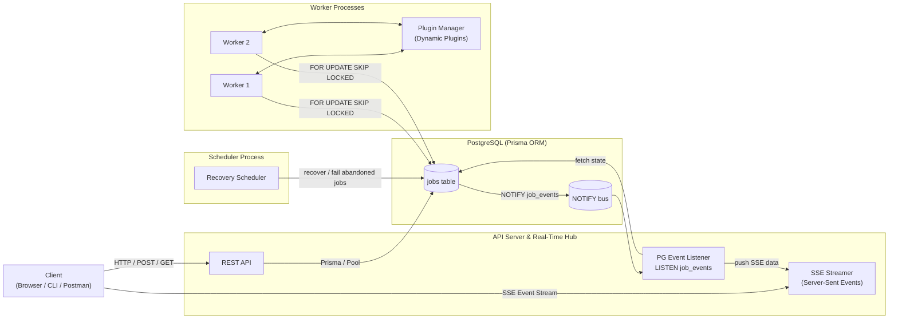

# Job Queue System

**PostgreSQL · Prisma ORM · Node.js · Extensible Plugins · Workers · SSE · Scheduler**

A production-grade **job queue & execution system** built with Node.js, PostgreSQL, and Prisma ORM. Designed with process isolation, safe database concurrency (`FOR UPDATE SKIP LOCKED`), and real-time job status streaming via **PostgreSQL `LISTEN / NOTIFY`** and **Server-Sent Events (SSE)**.

---

## ✨ Features

* **Prisma ORM Integration**: Managed schema definitions, migrations (`prisma db push`), and database pooling.
* **Extensible Plugin Engine**: Modular job execution powered by dynamically loaded plugins.
* **Safe Concurrent Job Claiming**: Prevents race conditions using row-level locking (`FOR UPDATE SKIP LOCKED`).
* **Multi-Process Architecture**: Decoupled API server, Worker processes, and Recovery Scheduler.
* **Real-Time Job Status Streaming**: Live updates using **Server-Sent Events (SSE)** (`GET /api/jobs/:id/subscribe`).
* **PostgreSQL `LISTEN / NOTIFY` Signaling**: Database-native event bus ensures zero polling overhead.
* **Automatic Failure & Abandoned Job Recovery**: Periodic scheduler process re-queues or fails stale running jobs.

---

## 🔌 Plugin Architecture & Vision

The core job queue relies on a plugin-based execution model where each job targets a specific plugin name and passes custom input payloads.

### Current Implementation
* Plugins reside in the `plugins/` directory.
* The worker dynamically loads the specified plugin module at runtime (via `loadPlugin`) and invokes its `execute({ job })` interface.

### Future Plugin System Roadmap
* **Zero Default Plugins**: The core job queue repo will ship completely lean without built-in default plugins.
* **External Repositories & Executables**: Plugins will exist as separate Git repositories or standalone executable packages.
* **Plugin Manager & Git Installation**: A future plugin management CLI/module will allow developers to install, update, and manage third-party or custom plugins directly from Git repositories or external binary releases.

---

## 🏗 Architecture Overview


```mermaid
flowchart LR
    Client["Client<br/>(Browser / CLI / Postman)"]

    subgraph API["API Server & Real-Time Hub"]
        HTTP["REST API"]
        SSE["SSE Streamer<br/>(Server-Sent Events)"]
        LISTENER["PG Event Listener<br/>LISTEN job_events"]
    end

    subgraph DB["PostgreSQL (Prisma ORM)"]
        JOBS[("jobs table")]
        NOTIFY[("NOTIFY bus")]
    end

    subgraph WORKERS["Worker Processes"]
        W1["Worker 1"]
        W2["Worker 2"]
        PLUGINS["Plugin Manager<br/>(Dynamic Plugins)"]
    end

    subgraph SCHEDULER["Scheduler Process"]
        SCH["Recovery Scheduler"]
    end

    Client -->|HTTP / POST / GET| HTTP
    Client -->|SSE Event Stream| SSE

    HTTP -->|Prisma / Pool| JOBS

    W1 -->|FOR UPDATE SKIP LOCKED| JOBS
    W2 -->|FOR UPDATE SKIP LOCKED| JOBS
    W1 <--> PLUGINS
    W2 <--> PLUGINS

    SCH -->|recover / fail abandoned jobs| JOBS

    JOBS -->|NOTIFY job_events| NOTIFY
    NOTIFY --> LISTENER

    LISTENER -->|fetch state| JOBS
    LISTENER -->|push SSE data| SSE
```

---

## 📂 Project Structure

```
Job-Queue/
├── .env
├── .env.example
├── prisma/
│   ├── schema.prisma        # Prisma database schema definition
│   └── migrations/          # Prisma database migration files
├── plugins/                 # Local plugin modules directory
├── src/
│   ├── api/
│   │   ├── routes/
│   │   │   └── job.routes.js    # Express REST API & SSE endpoints
│   │   ├── services/
│   │   │   └── job.services.js  # Job database service operations
│   │   ├── utils/
│   │   │   └── listener.js      # PG LISTEN job_events bridge to SSE
│   │   └── server.js            # Express API server entry point
│   │
│   ├── db/
│   │   └── db.js                # PostgreSQL connection pool (pg)
│   │
│   ├── jobs/
│   │   ├── pluginManager/
│   │   │   └── loadPlugin.js    # Dynamic plugin loader
│   │   ├── executor.js          # Plugin execution orchestrator
│   │   ├── jobRepo.js           # Worker DB queries & NOTIFY triggers
│   │   ├── scheduler.js         # Recovery scheduler process
│   │   └── worker.js            # Worker process entry point
│
├── package.json
└── README.md
```

---

## 🗃 Database Schema (Prisma)

Managed via `prisma/schema.prisma`:

```prisma
model jobs {
  id           String    @id @default(dbgenerated("gen_random_uuid()")) @db.Uuid
  plugin       String
  payload      Json?
  status       String
  result       Json?
  attempts     Int?      @default(0)
  max_attempts Int?      @default(3)
  error        String?
  created_at   DateTime? @default(now()) @db.Timestamp(6)
  started_at   DateTime? @db.Timestamp(6)
  finished_at  DateTime? @db.Timestamp(6)
}
```

---

## 🔁 Job Lifecycle

* **`PENDING`**: Job created via API, awaiting worker claim.
* **`RUNNING`**: Safely claimed by a worker using `FOR UPDATE SKIP LOCKED`.
* **`SUCCESSFUL`**: Plugin executed successfully and stored result.
* **`FAILED`**: Job execution failed or reached max retry attempts.

---

## 🛰 REST API Reference

Base Path: `/api`

### 1. Create a Job
* **POST** `/api/jobs`
* **Headers:** `Content-Type: application/json`
* **Request Body:**
  ```json
  {
    "plugin": "example-plugin",
    "payload": {
      "key": "value"
    }
  }
  ```
* **Response (201 Created):**
  ```json
  {
    "id": "88222c15-9e3e-40ab-89c6-77305295d36d",
    "plugin": "example-plugin",
    "payload": { "key": "value" },
    "status": "PENDING",
    "attempts": 0,
    "max_attempts": 3,
    "created_at": "2026-07-24T01:30:00.000Z"
  }
  ```

### 2. Stream Job Status (Server-Sent Events)
* **GET** `/api/jobs/:id/subscribe`
* **Headers:** `Accept: text/event-stream`
* **Behavior:** Establishes an SSE connection streaming real-time status updates as the job transitions (`PENDING` -> `RUNNING` -> `SUCCESSFUL`/`FAILED`). The connection automatically closes upon completion.
* **Sample Stream Output:**
  ```http
  data: {"jobId":"88222c15-9e3e-40ab-89c6-77305295d36d","status":"RUNNING","attempts":1,"error":null}

  data: {"jobId":"88222c15-9e3e-40ab-89c6-77305295d36d","status":"SUCCESSFUL","attempts":1,"error":null}
  ```

### 3. Get Job Details
* **GET** `/api/jobs/:id`

### 4. Get Job Status Only
* **GET** `/api/jobs/:id/status`

### 5. Delete Job
* **DELETE** `/api/jobs/:id` *(Not allowed if job status is `RUNNING`)*

---

## 🔄 Recovery Scheduler

The **Recovery Scheduler** (`npm run scheduler-dev`) runs every 60 seconds to clean up abandoned running jobs (e.g. from crashed worker nodes):
* **Re-queues (`PENDING`)** jobs with `attempts < max_attempts` that have been running for over 60 seconds.
* **Fails (`FAILED`)** jobs exceeding `max_attempts`.

---

## 🚀 Getting Started

### 1. Install Dependencies
```bash
npm install
```

### 2. Configure Environment Variables
Copy `.env.example` to `.env` and set your PostgreSQL credentials:
```env
PGHOST=localhost
PGUSER=postgres
PGPASSWORD=postgres
PGDATABASE=jobqueue
PGPORT=5432
PGSSLMODE=require

API_PORT=3000
```

### 3. Database Setup (Prisma)
Push schema definition to your PostgreSQL instance:
```bash
npm run db:setup
```

### 4. Run the System

Start the services (in separate terminal windows):

```bash
# Start API & SSE Stream Server
npm run api-dev

# Start Worker Process (run multiple instances for concurrency)
npm run worker-dev

# Start Recovery Scheduler
npm run scheduler-dev
```

---

## 📈 Future Roadmap

* **Plugin Package Manager**: Install and update plugins directly from remote Git repositories or CLI commands.
* **External Binary Executable Plugins**: Support plugins built as standalone binaries in any language (Go, Rust, Python, etc.).
* **Job Priorities & Delay Scheduling**: Priority-weighted queues and delayed job execution.
* **Dead-Letter Queue (DLQ)**: Dedicated inspection and retry handling for failed jobs.
